# House Marketplace App

A digital marketplace for users to view and post listings of house for sale or rent.

## Table of contents

- [Overview](#overview)
  - [Built with](#built-with)
- [Usage](#usage)
  - [Explore page](#explore-page)
  - [Offers page](#offers-page)
  - [Profile page](#profile-page)
  - [Creating listings](#creating-listings)
  - [Notifications](#notifications)
- [Issues](#issues)
- [Acknowledgments](#acknowledgments)

## Overview

This house marketplace app enables users to create an account to post and manage house listings for rent or for sale. Listing details can include photos, address, rent or sale price, number of bedrooms, number of bathrooms, parking, and a map location view. Users have the option to contact the landlord and inquire further about a listing. Secure authentication and a database is set up and managed through Firebase and the Firestore NoSQL. Google OAuth is enabled and configured to allow users to register and sign-in using their Google account.

#### Built with

- React.js
- Firebase for user authentication
- Firestore NoSQL for database
- React Router for multi-page routing
- React Toastify for real-time notifications
- Google OAuth for user sign-in and registration
- a geocoding API for map views of listing locations
- Swiper for slider to view image carousels
- deployed to Vercel

## Usage

#### Explore page

The main view of the app takes the user to the Explore page, displaying main images for recommended listings, and options to view listings for rent or listings for sale. The footer displays a navigation bar, allowing the user to navigate between the Explore page, the Offers page, and their Profile, if they are signed in.

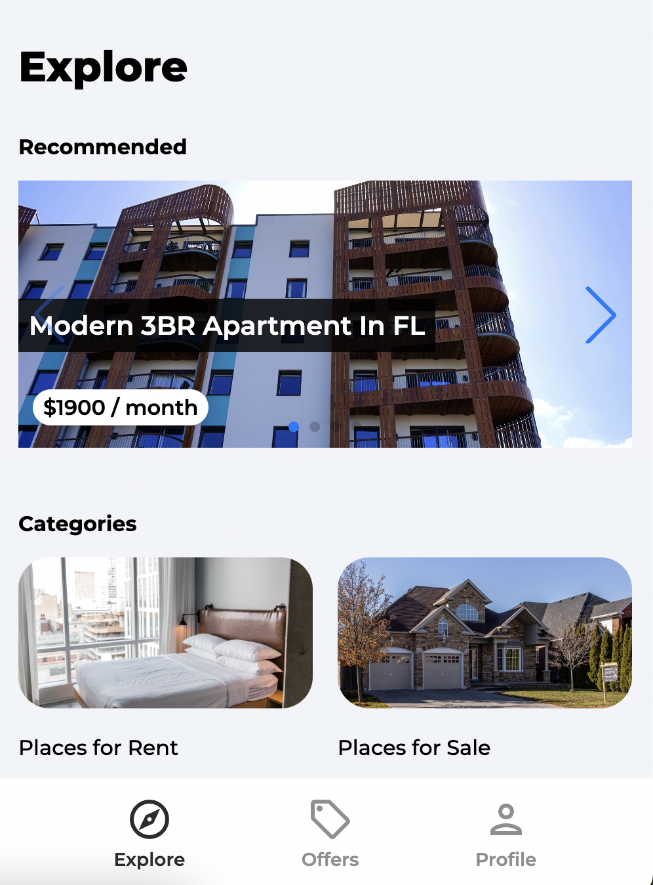

The recommended listings are shown on a slider, with each slide displaying a listing's main photo, along with the listing's title and rent/sale price. Users may tap or click a listing slide to open the individual listing with details and more images.

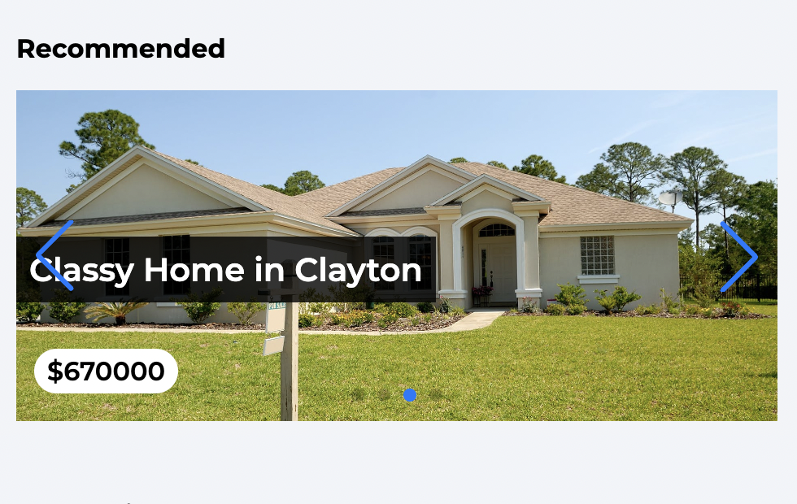

#### Offers page

The Offers page includes featured discounted listings, with some main details, such as title, address, rent/sale price, and number of bedrooms and bathrooms. Pagination is enabled to initially show up to 3 listings, with an option to click "Load More" to see additional listings.

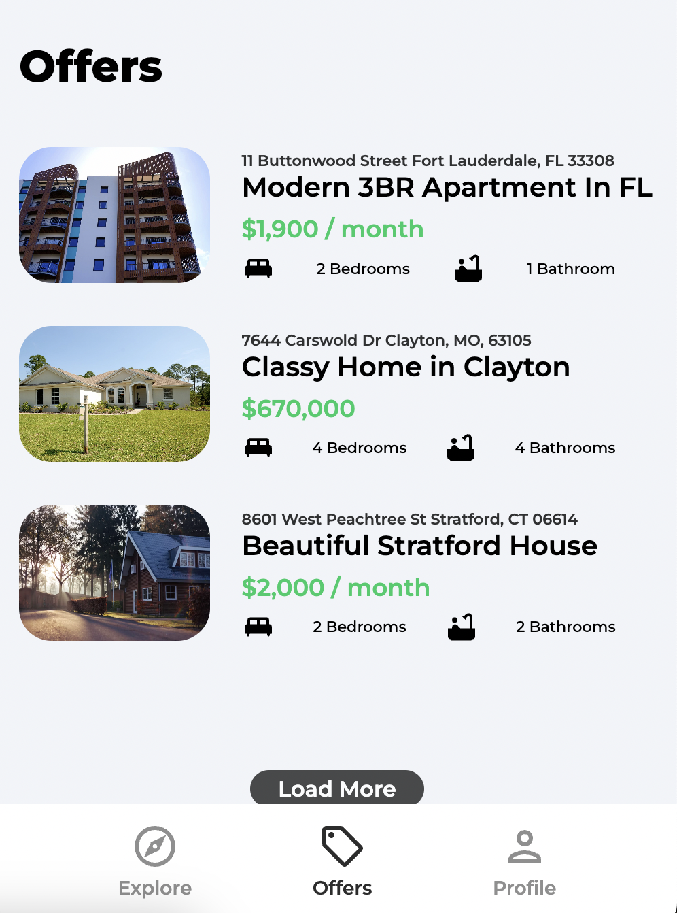

Individual listings show more details on each listing, including a map view based on the listing's address. Users may view the listing details and contact the listing's landlord or owner to inquire more.

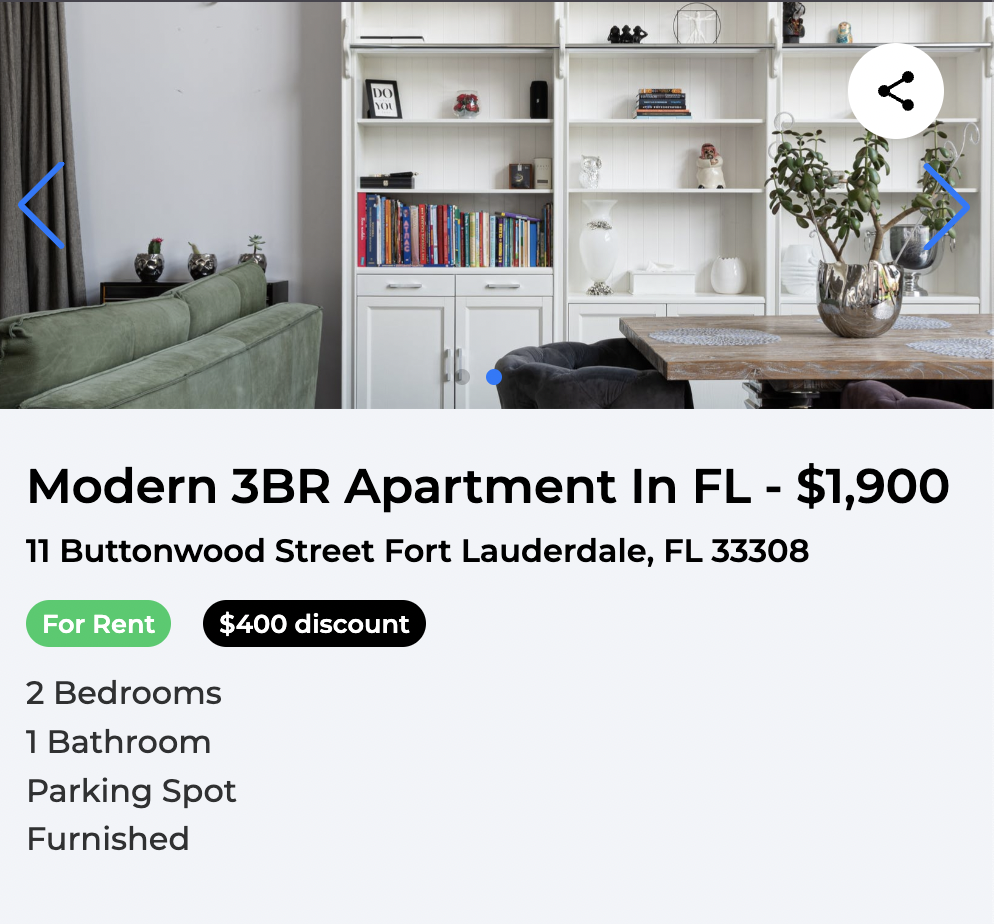 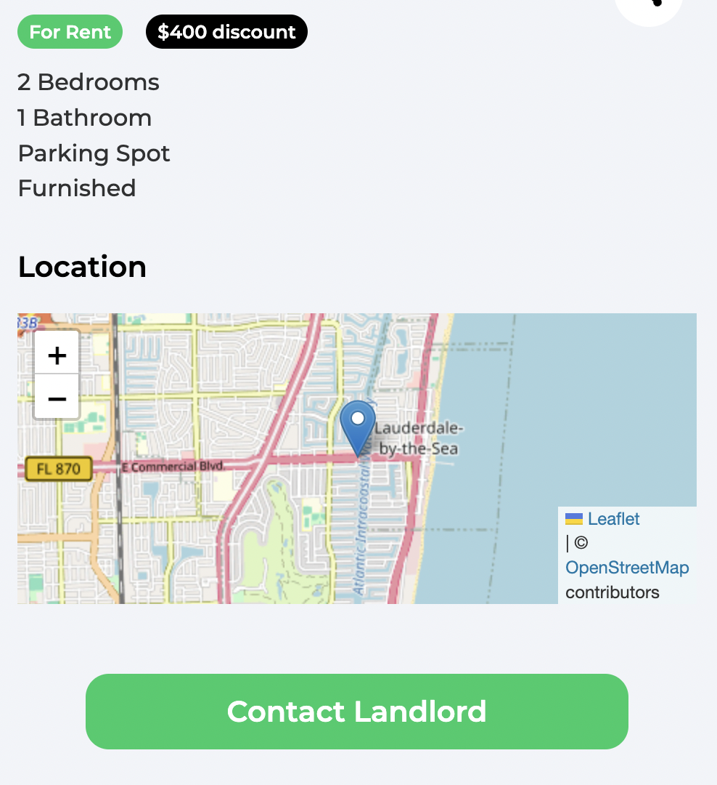

#### Profile page

If a user is not signed in, the Profile option navigates the user to the Sign In page. Users may sign in with an email and password, or sign in with their Google/Gmail account. If the user has forgotten their password, they may select "Forgot Password", routing them to a page to input their email address to receive a link to reset their password in Firebase.

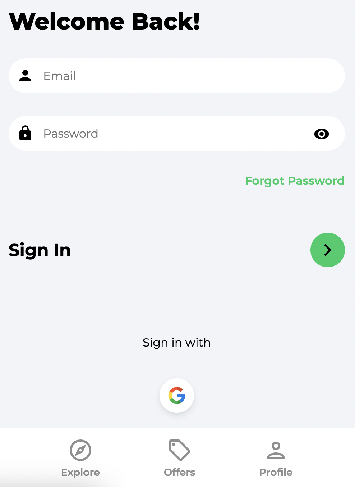

To sign in with Google, a Google account modal pops up, allowing the user to select an account to sign in with.

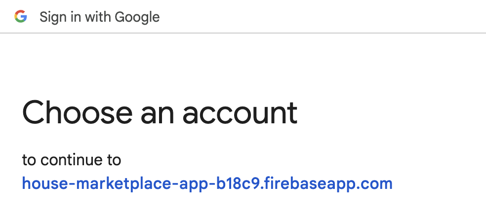

Once a user is signed in, the Profile option navigates the user to their profile, showing basic personal information for the account, as well as listings the user has posted. The user has the option to create new listings and manage or edit existing listings.

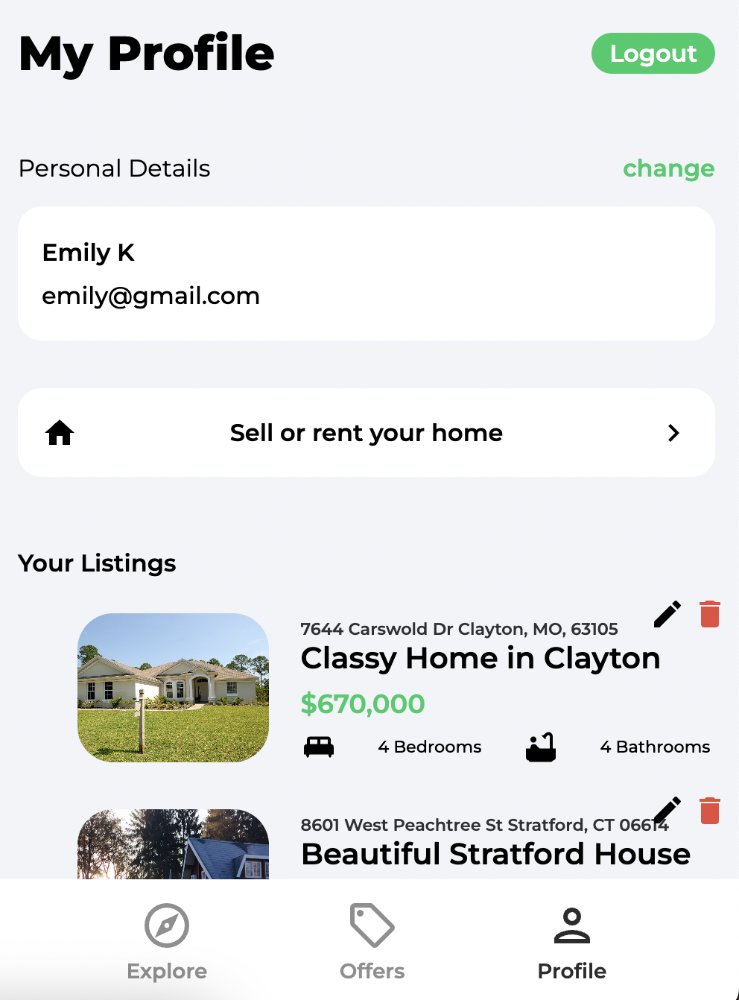

#### Creating listings

The form to create listings allows the user to quickly and easily fill in details about the listing, including whether it is for sale or for rent, the name/title for the listing, the number of bedrooms and bathrooms, whether there is reserved parking, whether it is furnished, the address, whether it has a special discount offer, the regular price, and up to 6 images.

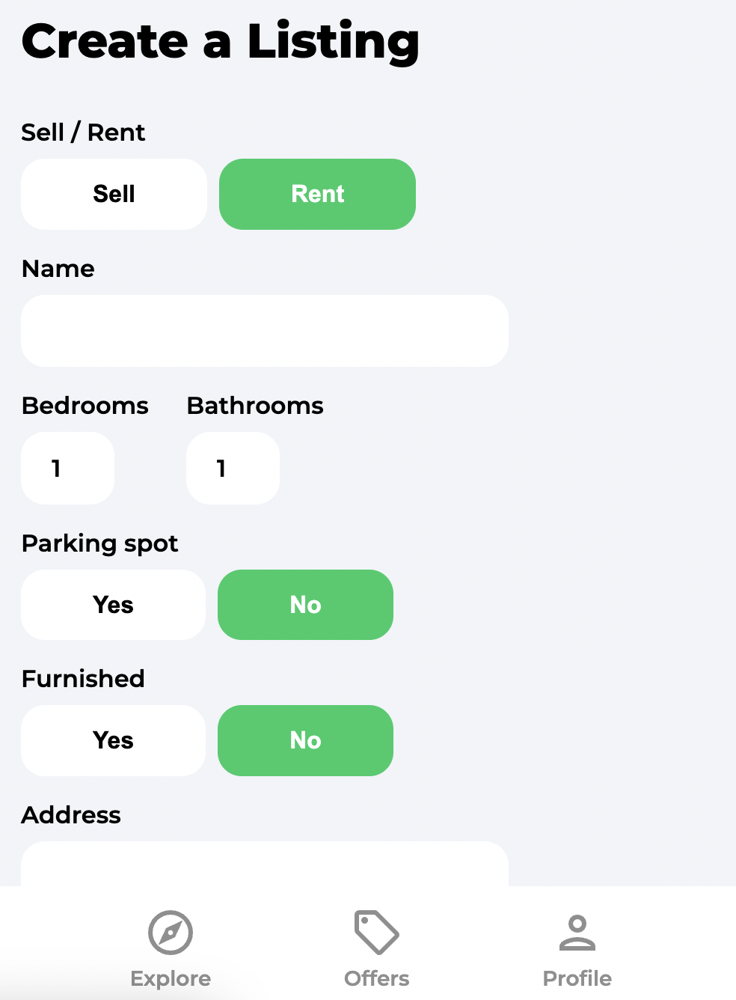 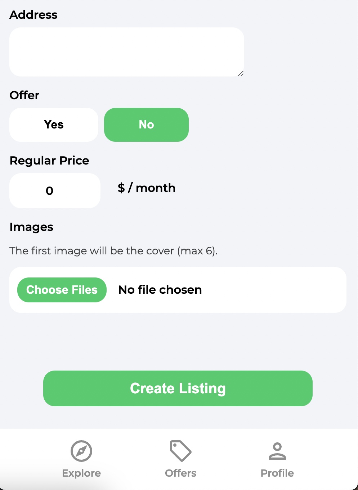

#### Notifications

React Toastify is enabled and used to notify users of various alerts based on actions such as signing up, Google OAuth success or failure, listing creation, and success or failure of contacting a listing's landlord.

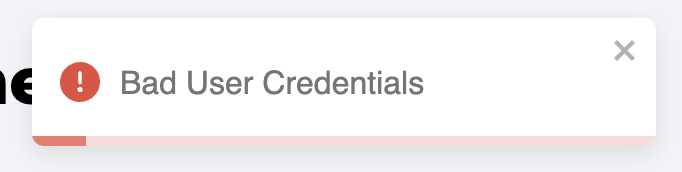 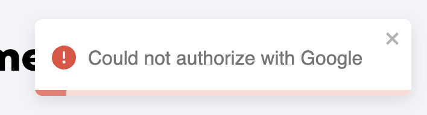

## Issues

- [ ] Page for registration of new users is missing from the Sign-in/Profile page

## Acknowledgments

Author: [Emily Knott](www.emilyknott.com)

This project was built as part of [Traversy Media](https://github.com/bradtraversy)'s comprehensive React course: [React Front to Back Course](https://www.traversymedia.com/Modern-React-Front-To-Back-Course)
